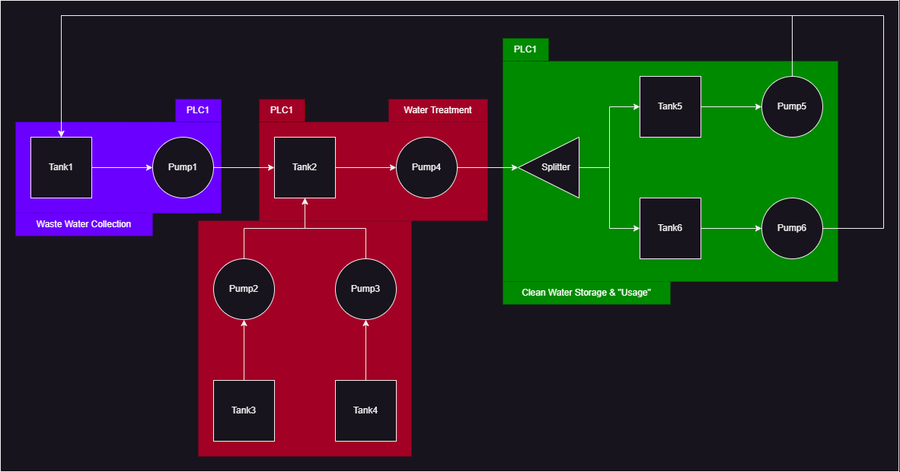

# 💧 SecureSim Process Overview

This simulation models a multi-stage **water treatment system** controlled by four PLCs and monitored by a SCADA system. The system processes wastewater into reusable clean water and handles overflow return.

---

## 🧭 System Summary

| Stage              | Description                                      | PLC      |
|-------------------|--------------------------------------------------|----------|
| Waste Collection   | Wastewater stored in Tank 1                     | `PLC1`   |
| Water Treatment    | Chemical treatment in Tank 2 (from T3, T4)      | `PLC2`   |
| Clean Water Output | Split and stored into Tank 5 & 6                | `PLC3`   |
| Return Handling    | Overflow routed back into Tank 1 (waste tank)   | `PLC3`   |

---

## 🏗️ Physical Layout (Node Overview)

- **Tank 1:** Wastewater tank (initially 900 units)
- **Tank 2:** Mixing/Treatment tank (clean water output)
- **Tank 3:** Chemical A (initially full)
- **Tank 4:** Chemical B (initially full)
- **Tank 5:** Clean Storage A (initially 100)
- **Tank 6:** Clean Storage B (initially 100)

---

## 🔁 Process Logic

### 🔹 Stage 1: Waste Pumping (PLC1)

- Pump 1 activates when **Tank 1 > 500**
- Stops when **Tank 1 ≤ 500**
- Wastewater flows from Tank 1 → Pump 1 → Tank 2

---

### 🔹 Stage 2: Chemical Treatment (PLC2)

- If **Tank 2 not full** (`< 1000`):
  - Pumps 2 & 3 activate to move chemicals from T3 and T4 into T2
- If **Tank 2 full**, Pump 4 activates to empty it into the splitter

---

### 🔹 Stage 3: Output Distribution (PLC3)

- Splitter directs clean output to:
  - Tank 5 (Storage A)
  - Tank 6 (Storage B)

---

### 🔹 Stage 4: Overflow Return (PLC3)

- If **Tank 5 or 6 > 250**, Pump 5 or 6 activates to return water to Tank 1

---

## 🖥️ SCADA

- Centralized monitor (via Modbus)
- Trigger: Emergency stop on register 99 will shut all pumps

---

## 🛠️ Integration

This layout integrates:
- MQTT for telemetry
- Modbus for control
- PLCs for local logic
- Streamlit UI for visualization

---

## 🖼️ Control System Diagram

