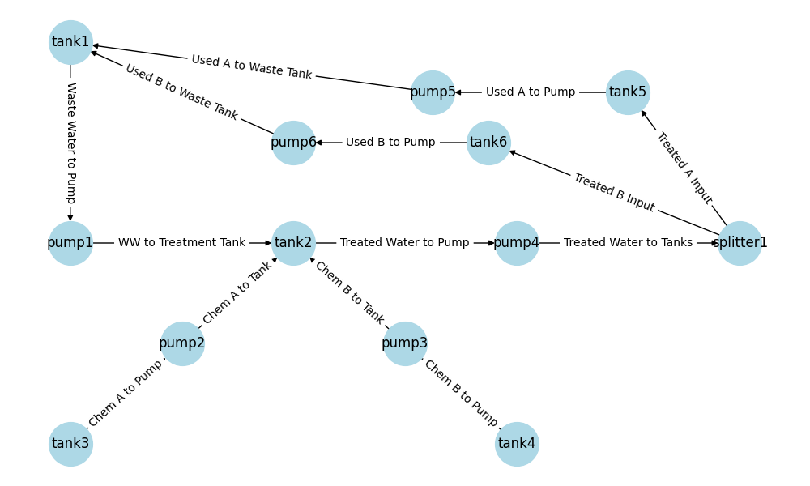
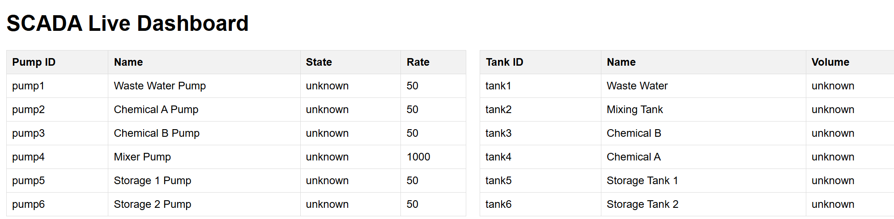
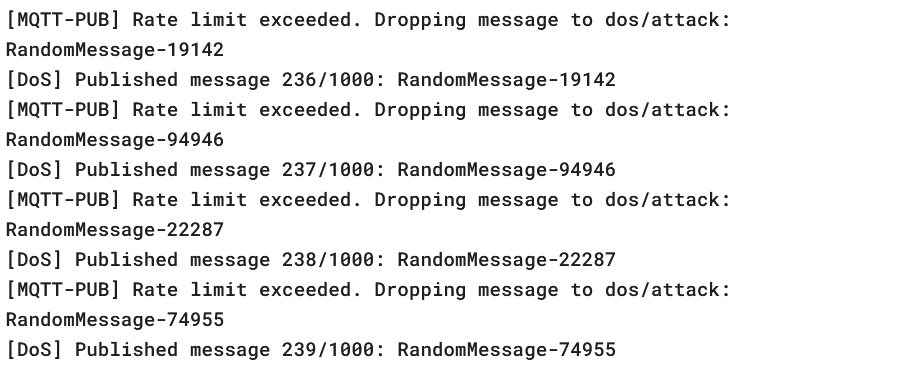
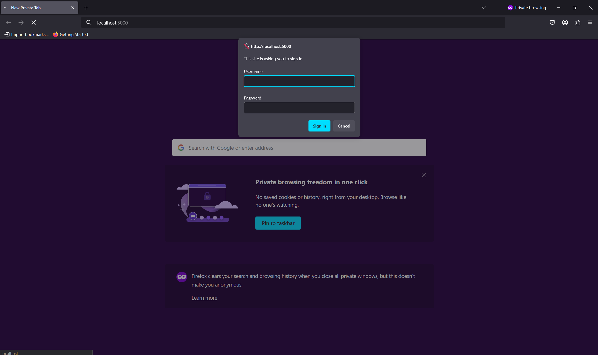
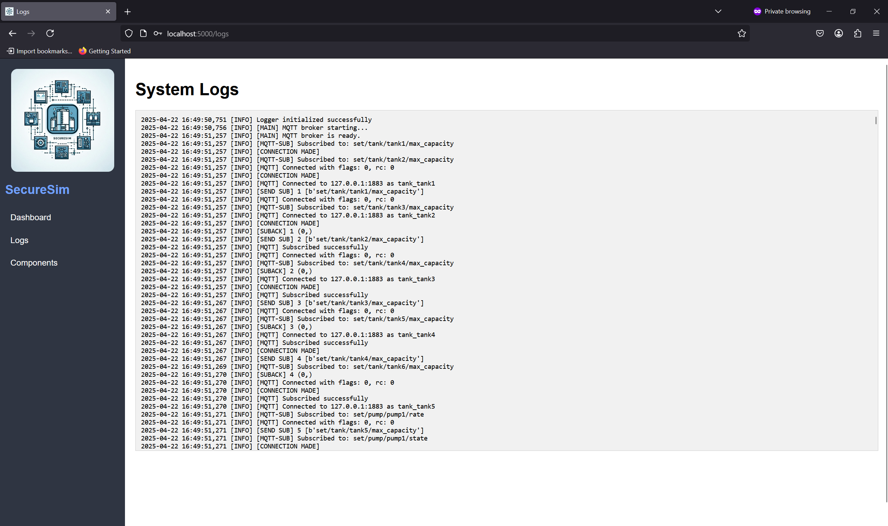

===============================
SecureSim Final Project Report
===============================

Project Overview
================
SecureSim is a modular simulation platform designed to emulate a real-world **Industrial Control System (ICS)**. The project focuses on:

- Simulating a realistic water treatment process
- Implementing and testing cybersecurity attacks
- Deploying defense mechanisms
- Providing a live web interface for monitoring

System Architecture
===================
The simulation is structured as a cyber-physical system with integrated process modeling, communication layers, and security logic.

Main folders and their roles:

- `process_sim/`: Fluid system simulation (tanks, pumps, lines, splitters)
- `control_logic/`: PLC & SCADA logic (Modbus control)
- `attacks/`: Replay, DoS
- `defenses/`: Logging, rate limiting, UI authentication
- `scada_ui/`: Flask-based interface
- `servers/`: MQTT + Modbus servers

Process Modeling
================
SecureSim models a simplified water treatment facility composed of interconnected tanks and flow control mechanisms. The system includes:

- **Tank 1**: Serves as the initial intake for wastewater.
- **Tank 2**: Functions as a chemical mixing tank that receives flow from Tank 1.
- **Tanks 3 & 4**: Contain Chemical A and B, respectively, used for the treatment process.
- **Splitter**: Distributes treated water from Tank 2 to downstream storage tanks.
- **Tanks 5 & 6**: Act as clean water storage tanks, receiving output from the splitter.

If either Tank 5 or 6 exceeds its capacity, overflow return pumps are triggered to redirect excess water back to Tank 1, maintaining a closed-loop process.

Control Logic
=============

**PLCs (Programmable Logic Controllers)**  
The PLCs in SecureSim are responsible for localized control of the system’s components. Each PLC operates independently and uses threshold-based logic to determine the appropriate control actions for connected devices:

- They continuously monitor sensor inputs such as tank volume or pump status.
- Based on preconfigured rules, they open or close pumps when specific conditions are met (e.g., "open Pump 1 when Tank 1 volume > 500").
- Their decisions are reflected by updating values in Modbus holding registers, which serve as the communication interface between the simulation and control logic.
- These registers are mapped to each component and provide a structured way to read and write operational states.

**SCADA (Supervisory Control and Data Acquisition)**  
The SCADA system acts as a centralized monitoring and control authority for the entire simulation:

- It observes the global state of the system through all Modbus registers, aggregating data from every PLC and component.
- The SCADA logic includes safety features, such as triggering an emergency shutdown if critical conditions (e.g., register 99 == 1) are detected.
- It also supports overriding PLC logic by writing directly to component registers, providing higher-level control when needed.
- The SCADA interface is accessible through a password-protected UI and provides live system status, log visibility, and control toggles.

Attack Implementation
=====================

**Replay Attack**
-----------------

The Replay Attack simulates a subtle yet powerful method of data manipulation common in industrial cyber threats. It works by intercepting and recording legitimate MQTT messages during a clean simulation run, capturing component states such as tank volumes or pump status along with their respective timestamps. Later, during an active simulation, these stored messages are resent in the same order and timing as the originals.

This attack is especially effective in systems that rely heavily on periodic updates without robust anomaly detection. In SecureSim, the replayed values masked tank overflows and led to unsafe conditions being interpreted as normal by the SCADA system.

**Denial of Service (DoS) Attack**
----------------------------------

The DoS attack targets system availability by overwhelming the MQTT communication layer with a flood of high-frequency, irrelevant messages. The attacker publishes a large number of randomized payloads to one or more MQTT topics, some of which may be valid, and others are purely noise. This deluge saturates the broker, resulting in delayed or dropped messages that prevent the UI, PLCs, and SCADA from receiving timely updates.

As the system becomes overloaded, real sensor data cannot propagate through the message queue effectively, leading to outdated visualizations, missed emergency conditions, and reduced control accuracy. In SecureSim, this attack rendered the Flask dashboard partially unresponsive and prevented PLC logic from executing at normal cadence, demonstrating the fragility of unprotected real-time systems.

Defense Mechanisms
==================

**Logging & Auditing**
----------------------

SecureSim implements a robust logging and auditing framework that continuously records all MQTT traffic and control commands issued within the simulation. This data is persistently stored in the `/data/logs.txt` file, which provides a comprehensive, timestamped history of system activity. These logs are invaluable for both real-time monitoring and post-event forensic analysis, allowing operators to detect irregularities such as message delays, missing updates, or unusual control behavior indicative of attacks.

**UI Authentication**
---------------------

To prevent unauthorized access and safeguard critical control features, SecureSim integrates password protection into the SCADA web interface. This layer of authentication ensures that only verified users can initiate emergency stops, view system logs, or toggle attack and defense mechanisms. By requiring user credentials before granting access to high-privilege actions, the system enforces a simple but effective security boundary that can deter casual misuse or scripted UI manipulation.

**Rate Limiting**
-----------------

In order to counteract brute-force and flooding attacks, a rate-limiting mechanism has been implemented on the Modbus communication layer. Specifically, write operations to Modbus registers are throttled to prevent attackers from executing rapid-fire command injections that could destabilize the system. This defense is particularly effective against DoS-style attacks that attempt to overwhelm control components with a high volume of updates. By enforcing a cap on how frequently a component's state can be updated.

Evaluation & Results
====================

Evidence of Attack Effects
--------------------------

- **Replay Attack**: During the replay period, the system failed to respond to real-time changes in tank volume, as outdated MQTT messages were injected with the same timing and payloads as the original data. The log files revealed repeated volume values and misleading state transitions. This behavior caused SCADA logic to misinterpret system status, allowing potentially dangerous conditions to go unaddressed.

- **DoS Attack**: The Denial of Service attack overwhelmed the MQTT broker with rapid message bursts, effectively clogging communication channels. As a result, critical updates to the SCADA and PLCs were dropped or delayed. This led to gaps in the Flask UI, unresponsive component indicators, and failures in control logic that relied on timely feedback.

.. image:: ./dos.png
   :alt: Tank Levels Graph
   :align: center
   :width: 90%

UI-Based Defense Demonstrations
-------------------------------

**Rate Limiting:**  

The system’s rate limiter was implemented on Modbus register interactions to prevent excessive write attempts. When attackers attempted to override PLC decisions rapidly through scripted writes, only a limited number of those writes were allowed per second. This throttling effectively neutralized attempts to execute DoS-like logic injection on critical components.

**Login Screen (UI Authentication):**  

To protect the SCADA interface from unauthorized access, a password layer was added to the Flask dashboard. This ensures that attackers or unprivileged users cannot trigger defenses, execute shutdowns, or tamper with logs or PLC overrides.

**Log View Page:**  

The SecureSim UI includes a dedicated logging panel that continuously displays system events, MQTT messages, control decisions, and Modbus register interactions. This was crucial for identifying both the replay and DoS attack patterns after the fact. The logs showed repeated values, missing states, and time offsets that revealed anomalies in system behavior.

Performance Metrics
-------------------

- **Replay Attack**

  - Evasion success: 100% (under static threshold logic)
  - Detection: Identified only during post-attack log review
  - Impact: Prevented SCADA from acting on the real-time state

- **DoS Attack**

  - Saturation observed after ~500 messages/sec
  - PLC and UI components began missing state updates
  - SCADA failed to apply emergency rules consistently

- **Defenses**

  - **Logging**: Captured all control traffic and anomalies in `/data/logs.txt`
  - **Rate Limiting**: Prevented attackers from writing rapid override loops
  - **Login Layer**: Prevented unauthorized UI manipulation and attack toggling

Team Collaboration
==================

The SecureSim project was developed using a modular approach that enabled the team to work in parallel across multiple areas of the simulation. This included distinct responsibilities for modeling the physical process system, developing SCADA and PLC logic, implementing the Flask-based UI, and constructing both offensive and defensive cybersecurity modules. Version control was maintained via GitHub, which also supported automated deployment of documentation through GitHub Actions. This structure helped streamline iteration and fostered clear ownership of each subsystem.

Challenges & Limitations
========================

Throughout development, the team encountered a number of technical challenges. Synchronizing MQTT and Modbus communication under high-load scenarios proved difficult, occasionally leading to missed state updates or inconsistent UI behavior. Executing the DoS attack at a time that maximized its impact required tuning message rates and topics. Similarly, aligning replayed messages with realistic system states required careful capture and timing control. In addition, the UI sometimes experienced race conditions and lag when handling large volumes of MQTT messages in quick succession.

Conclusions & Future Work
=========================

The project demonstrated that ICS environments, even in simulated form, are highly susceptible to lightweight cyberattacks such as DoS and replay injection. However, even simple mitigation techniques, such as logging, access control, and rate limiting, proved effective in detecting and slowing down malicious activity.
